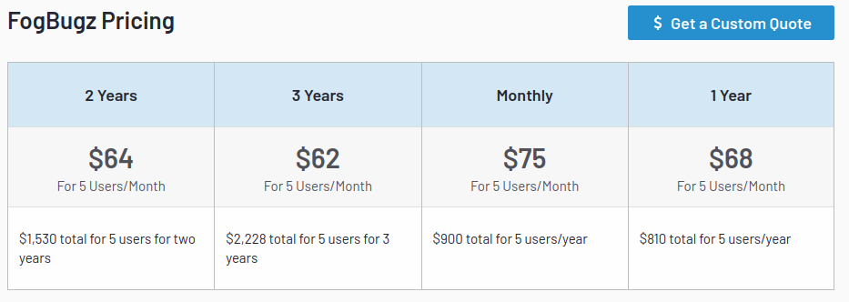
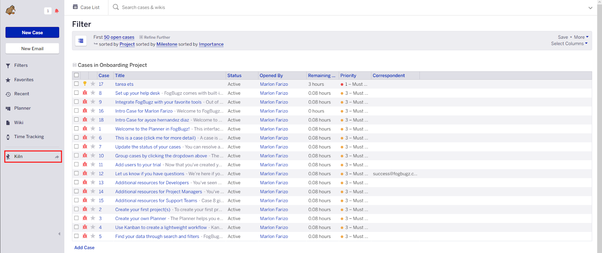
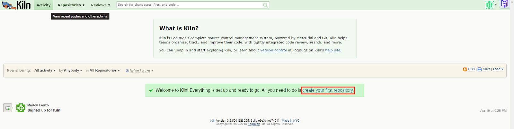
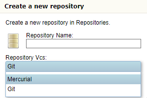
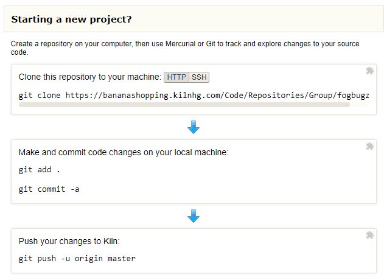
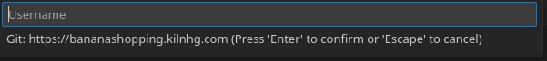
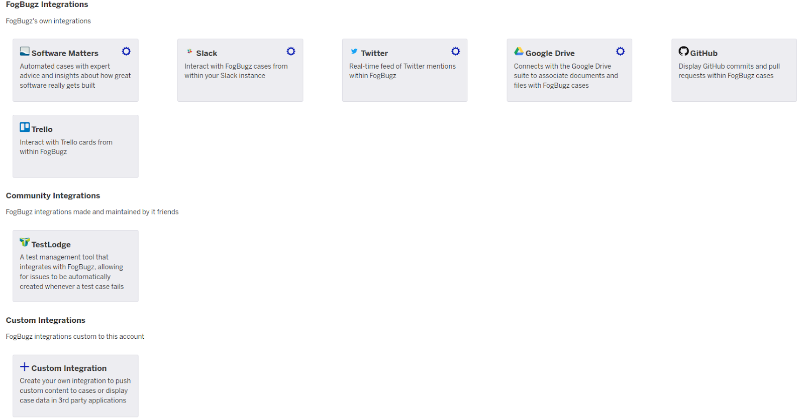

</img>

**Nombres:** [Ayoze Hernández Díaz](https://github.com/ElPayo) y [Marlon Farizo Hergueta](https://github.com/marlonfrz)

**Curso:** 1º Desarrollo de Aplicaciones Web.

**Asignatura:** Entornos de desarrollo.

## ÍNDICE

+ [1. ¿Que son las herramientas CI/CD?](#id0)
+ [2. ¿Qué es, y dentro de qué grupo de las herramientas CI/CD está?](#id1)
+ [3. ¿Qué ofrece?](#id2)
+ [4. Plan de precios](#id3)
+ [5. Ejemplo de integración con repositorios de código.](#id4)
+ [6. Ejemplo de documentación de proyectos.](#id5)
  + [6.1 Ejemplo de documentación de proyectos.](#id5.1)
  + [6.2 Como crear una wiki.](#id5.2)
+ [7. Otras herramientas con las que se integra.](#id6)
+ [8. Comparativa con otras herramientas](#id7)
+ [9. ¿Por qué escoger la herramienta frente a otras?](#id8)

## 1. ¿Qué son las herramientas CI/CD? 

CI y CD son herramientas cuyo nombre significa integración continua (CI: continuous integration) y entrega continua (CD:
continuous delivery) y son prácticas de desarrollo software que implican la automatización de la construcción, prueba y
despliegue de aplicaciones con el objetivo de mejorar la calidad del software y acelerar su entrega al mercado.

Las herramientas CI/CD son software que facilitan la implementación de estas prácticas al automatizar diferentes etapas del ciclo de vida del desarrollo de software. Algunos ejemplos son: 

+ Travis
+ Jenkins 
+ GitLab CI/CD 

----

## 2. ¿Qué es, y dentro de qué grupo de las herramientas CI/CD está? 

Esta herramienta no pertenece a ningún grupo CI/CD, si no, es una herramienta de gestión de proyectos y tareas, como también de
seguimiento de errores, problemas, utilizada en el desarrollo de software. Se utiliza para facilitar la comunicación y el
trabajo en equipo.

----

## 3. ¿Qué ofrece? 

Este gestor de proyecto ofrece un kanban donde puedes asignar tareas a los colaboradores, asignar tiempos y filtrarlas por
columnas según el estado en el que se encuentren además de agrupar por diferentes categorías como: a quien está asignada dicha
tarea, según su prioridad o estado. A cada tarea pendiente se le puede poner un “tag” que especifique con qué se relaciona, por
ejemplo, con arreglo de bugs, con reuniones del equipo, con implementación de nuevo código.
Además de lo previamente dicho ofrece una herramienta extra, Kiln, que se puede integrar en el repositorio de Github del
proyecto realizado

----

## 4. Plan de precios 

Los planes de fogbugz son los siguientes:

</img>

Se puede ver con detalle cuanto te sale al mes por 5 usuarios, además de esto es posible obtener una cuota personalizada según
las necesidades de tu empresa.

----

## 5. Ejemplo de integración con repositorios de código. 

En primer lugar no hemos podido realizarlo personalmente debido a que es necesario una VM, un servicio de hosting y un nombre de dominio propio, todo esto para poder acceder al dominio viculado a la maquina virtual desde la propia herramienta de fogbugz, además de que por ahora no tenemos los medios para implementar aplicaciones web.

Este apartado no lo hemos podido encontrar realizado debido a la falta de videos explicativos en la red.

----

## 6. Ejemplo de documentación de proyectos. 

### 6.1 Como crear un repositorio. 

+ Paso 1:

Nos situamos en la página principal de Fogbugz y hacemos click en la sección marcada.

 

+ Paso 2:

Nos lleva a la siguiente página en la que debemos hacer click en **create your first repository**.

+ Paso 3:

Se abre el siguiente desplegable, rellenamos los datos que nos pide según lo que usemos, se puede ver que nos da la opción a
elegir entre Git o Imperial.

+ Paso 4:

Después nos redirige a una página en la que pregunta si es un repositorio nuevo, uno existente o si queremos importar lo que
tengamos desde otro servicio llamado [Subversion](https://subversion.apache.org). Como es un proyecto nuevo seguimos los pasos que se nos indican a
continuación.

+ Paso 5:

Una vez hecho todo esto nos dirigimos a nuestro editor de código, en nuestro caso [VSCode](https://code.visualstudio.com), y ahí, usando los comandos anteriores podemos hacer _**pull**_ del repositorio creado en la herramienta de Fogbugz, para ello nos pide usuario y contraseña de la misma, el cual será el correo que hayamos usado para acceder a la ella.

### 6.2 Como crear una wiki. 

Debido a que el periodo de prueba de la herramienta fue corto, no pudimos implementar una wiki, pero si pudimos encontrar este [video](https://www.youtube.com/watch?v=4ZNZuh58iXc&list=PLJaF-8iLGlU4z7gzUbFKr5Nx9GZSMsl-d&index=7) explicativo.

----

## 7. Otras herramientas con las que se integra. 

Fogbugz integra Software matters, slack, Twitter, Google Drive, Github y Trello por su cuenta, además de que la comunidad
permite que integres TestLodge. Además permite que integres tus propias herramientas.

----

## 8. Comparativa con otras herramientas 

|Caracteristica \ Herramienta|  Gitlab | Fogbugz |
|---|:-:|:-:|
|Aplicación Android| ❌  |  ❌ |
|Aplicación Iphone| ✅ | ❌  |
|Aplicación web| ✅ |  ✅ |
|Aplicación de escritorio| ❌ | ❌  |
|Material de ayuda| ✅ | ❌ |   
|Tamaño de empresas|  Grandes-pequeñas |  Grandes-pequeñas |

|Caracteristica \ Herramienta|  Github | Fogbugz |
|---|:-:|:-:|
|Aplicación Android|  ✅ |  ❌ |
|Aplicación Iphone| ✅ | ❌  |
|Aplicación web| ✅ |  ✅ |
|Aplicación de escritorio| ❌ | ❌  |
|Material de ayuda| ✅ | ❌ |   
|Tamaño de empresas| Grandes-pequeñas y freelancers  |  Grandes-pequeñas |

|Caracteristica \ Herramienta|  Trello | Fogbugz |
|---|:-:|:-:|
|Aplicación Android|  ✅ |  ❌ |
|Aplicación Iphone| ✅ | ❌  |
|Aplicación web| ✅ |  ✅ |
|Aplicación de escritorio| ✅ | ❌  |
|Material de ayuda| ✅ | ❌ |   
|Tamaño de empresas| Grandes-pequeñas y freelancers  |  Grandes-pequeñas |

----

## 9. ¿Por qué escoger la herramienta frente a otras? 

+ La herramienta es muy cómoda e intuitiva, estando muy bien documentada y
con un buen servicio técnico que la respalda. 

+ Entre sus caracteristicas te ofrece un gestor de proyectos y una herramienta de revisor de código que se integra tanto con Imperial como con
Git.

+ Además tiene precios asequibles teniendo en cuenta los servicios que presta.

+ Tiene compatibilidad con muchas herramientas, y además permite la integración de herramientas personalizadas.

